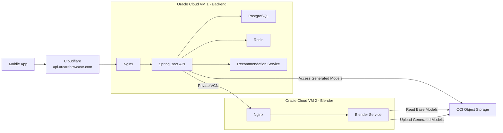

# 🚗 AR Car Showcase

An immersive **Augmented Reality Car Showcase** platform that enables users to browse, customize, and visualize vehicles in their real-world environment using mobile Augmented Reality.

Built with **React Native**, **Spring Boot**, **Blender**, and **Oracle Cloud Infrastructure** to deliver real-time 3D customization and AR experiences.

---

## 🚀 Platform Overview

AR Car Showcase (ARCS) combines mobile AR technology, cloud-based 3D processing, intelligent recommendations, and scalable cloud infrastructure to create an interactive vehicle exploration experience.

Users can:

* Browse a comprehensive vehicle catalog
* Customize vehicle colors and materials
* Generate personalized 3D models
* Experience vehicles through Augmented Reality
* Receive AI-powered vehicle recommendations
* Save and manage customized designs

---

## 🚀 Quick Links

🌐 Website: https://arcarshowcase.com

🔗 API: https://api.arcarshowcase.com/api

📦 Latest Release:
https://github.com/AR-Car-Showcase/mobile-app/releases/latest

---

## ☁️ Production Architecture



---

## 🏗️ Infrastructure Highlights

### Oracle Cloud Infrastructure

* Two Oracle Cloud Always Free VMs
* Private VCN networking
* Oracle Object Storage
* OCI IAM Policies
* OCI Instance Principals

### Security

* Cloudflare DNS & Proxy
* HTTPS with Let's Encrypt
* Nginx Reverse Proxy
* JWT Authentication
* Spring Security
* Email Verification

### Scalability

* Containerized deployment using Docker
* Separate compute for backend and 3D generation
* Cloud object storage for generated assets
* Service isolation through private networking

---

## 🔄 3D Generation Pipeline

When a user customizes a vehicle:

1. Customization request is submitted from the mobile application.
2. Spring Boot validates and processes the request.
3. Blender Service receives generation instructions.
4. Base vehicle model is downloaded from OCI Object Storage.
5. Materials and colors are applied dynamically.
6. A customized GLB model is generated.
7. Generated model is uploaded back to OCI Object Storage.
8. Model URL is returned to the application.
9. User can instantly view the customized vehicle in AR.

```text
Mobile App
      ↓
Spring Boot API
      ↓
Blender Service
      ↓
OCI Object Storage
      ↓
Generated GLB URL
      ↓
AR Viewer
```

---

## ☁️ Cloud Deployment

AR Car Showcase is deployed entirely on Oracle Cloud Infrastructure.

Deployment stack:

* Cloudflare
* Nginx
* Spring Boot
* PostgreSQL
* Redis
* Recommendation Service
* Blender Service
* Oracle Object Storage

The platform uses private VM-to-VM communication through Oracle VCN networking while exposing only the public API endpoint.

```text
Internet
    ↓
Cloudflare
    ↓
Nginx
    ↓
Spring Boot
    ↓
Private VCN
    ↓
Blender Service
```

---

## 🔐 OCI Instance Principals

The Blender Service uses Oracle Cloud Instance Principals for secure access to Object Storage.

Benefits:

* No API keys stored in containers
* No OCI credentials mounted into Docker
* IAM-managed permissions
* Secure upload/download operations

This follows a production-grade cloud security approach for service authentication.

---

## 🛠️ Technology Stack

### Mobile Application

* React Native
* Expo
* TypeScript
* ViroReact
* React Three Fiber
* Three.js
* Expo Router

### Backend Services

* Spring Boot
* PostgreSQL
* Redis
* Spring Security
* JWT Authentication
* Docker

### AI & Recommendations

* Python
* FastAPI
* Machine Learning Recommendation Engine

### 3D Processing

* Blender
* Python
* Flask

### Cloud & Infrastructure

* Oracle Cloud Infrastructure (OCI)
* Cloudflare
* Nginx
* Let's Encrypt
* Docker Compose
* Oracle Object Storage

---

## ✨ Features

* 🔭 Augmented Reality Vehicle Placement
* 🎨 Real-Time Vehicle Customization
* 🚗 Interactive 3D Vehicle Viewer
* 🤖 AI-Powered Vehicle Recommendations
* 🔐 Secure Authentication System
* 💾 Personal Showroom & Saved Designs
* ☁️ Cloud-Based 3D Model Generation
* 🌐 HTTPS Enabled Infrastructure
* ⚡ Private Multi-VM Cloud Architecture
* 📦 Cloud Object Storage Integration

---
## 📦 Repositories

| Repository | Description |
|------------|-------------|
| [Mobile App](https://github.com/AR-Car-Showcase/mobile-app) | React Native application with AR and 3D visualization |
| [Spring Boot Server](https://github.com/AR-Car-Showcase/spring-boot-server) | Core backend APIs and business logic |
| [Blender Service](https://github.com/AR-Car-Showcase/blender-service) | Automated 3D model generation pipeline |
| [Recommendation Service](https://github.com/AR-Car-Showcase/recommendation-service) | AI-powered vehicle recommendation engine |

---

## 📄 License

MIT License
