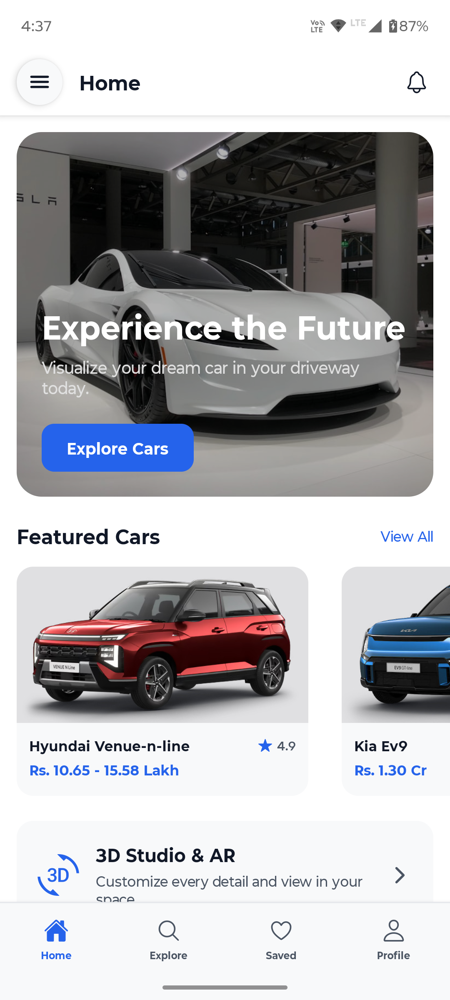
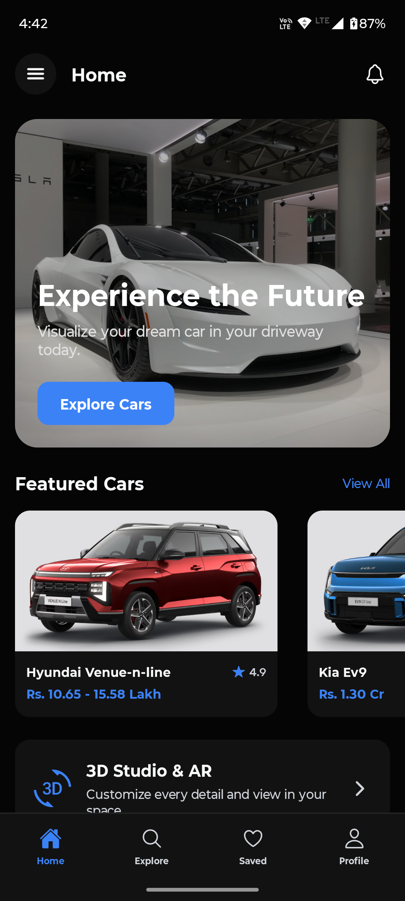
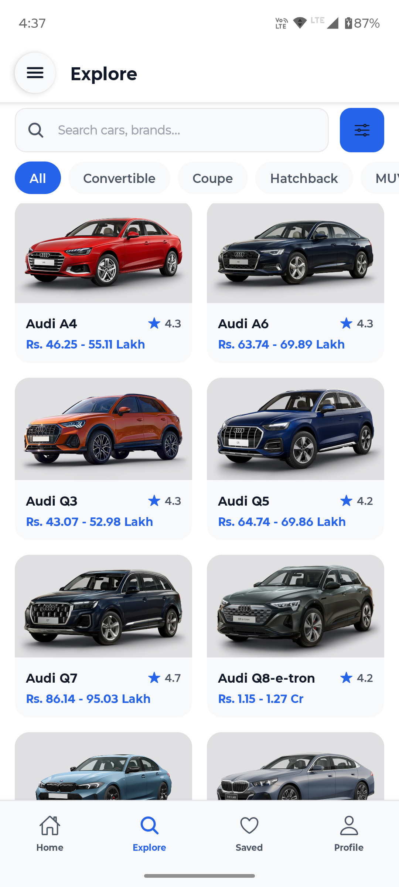
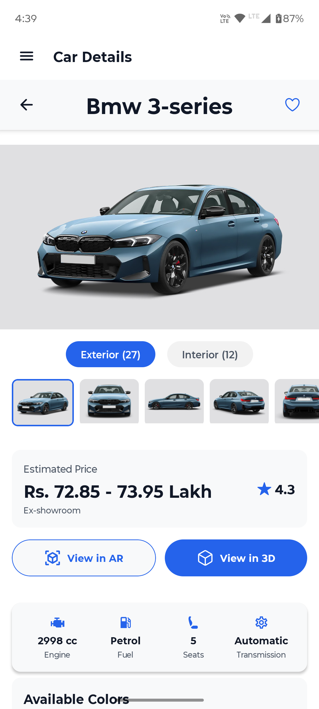
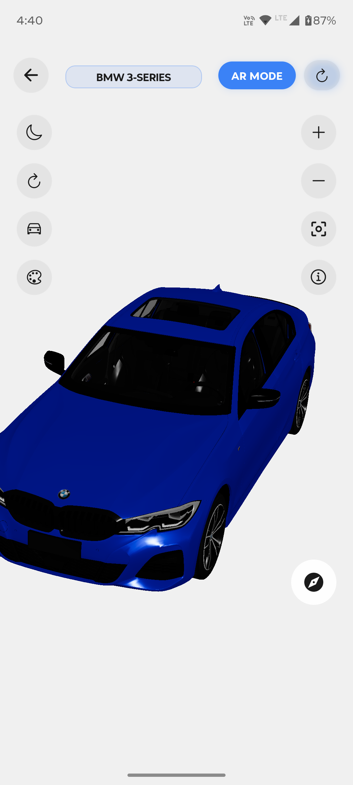
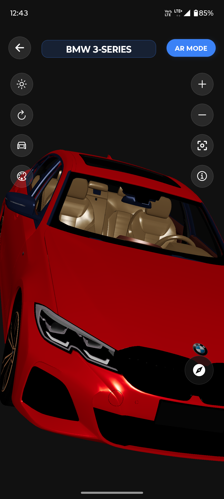
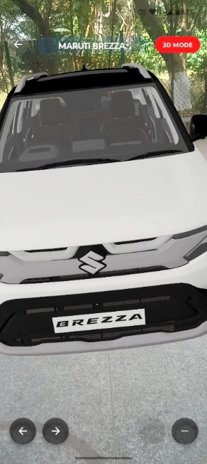
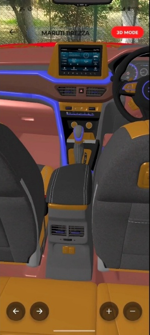
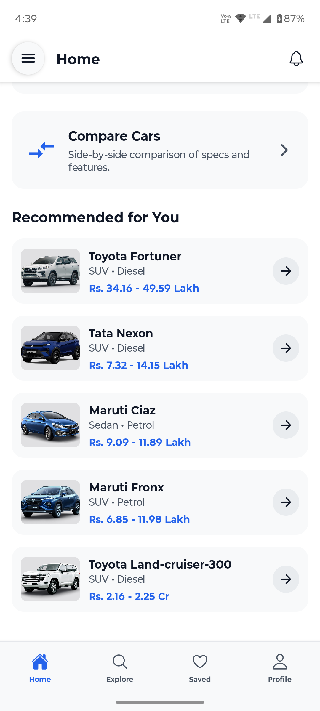
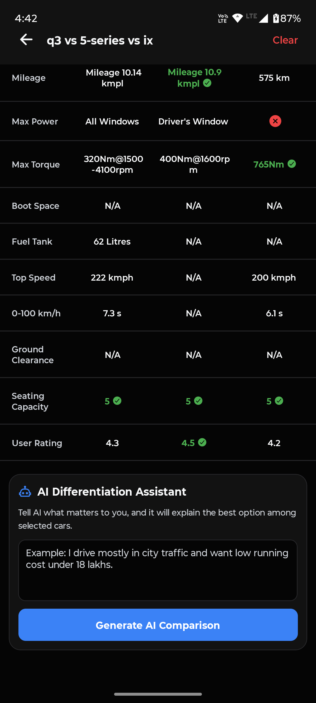

# 🚗 AR Car Showcase

An immersive **Augmented Reality Car Showcase** platform that enables users to browse, customize, and visualize vehicles in their real-world environment using mobile Augmented Reality.

Built with **React Native**, **Spring Boot**, **Blender**, and modern cloud infrastructure to deliver real-time 3D customization and AR experiences.

---

## 🚀 Platform Overview

AR Car Showcase (ARCS) combines mobile AR technology, cloud-based 3D processing, and intelligent recommendations to create an interactive vehicle exploration experience.

Users can:

* Browse a comprehensive vehicle catalog
* Customize colors and materials in real time
* Generate personalized 3D models
* Experience vehicles through Augmented Reality
* Receive AI-powered vehicle recommendations
* Save and manage customized designs

---

## 📸 App Screenshots

| Home (Light) | Home (Dark) |
|:---:|:---:|
|  |  |
| **Explore Catalog** | **Car Details** |
|  |  |
| **3D Studio** | **Customized Model (Dark)** |
|  |  |
| **AR Mode** | **AR Customized** |
|  |  |
| **AI Recommendations** | **AI Compare Chatbot** |
|  |  |

For the complete screenshot gallery and mobile application documentation, visit the Mobile App repository.

---

## 🏗️ System Architecture

```text
┌─────────────────────────────────────────────────────────┐
│          Mobile Client (React Native / Expo)           │
│  • Vehicle Catalog                                     │
│  • 3D Customization Studio                             │
│  • Augmented Reality Viewer                            │
│  • User Authentication                                 │
└────────────────┬───────────────────────────────────────┘
                 │
                 ▼
┌─────────────────────────────────────────────────────────┐
│              Cloudflare Network Layer                  │
│        DNS • CDN • SSL • Security Protection           │
└────────────────┬───────────────────────────────────────┘
                 │
                 ▼
┌─────────────────────────────────────────────────────────┐
│                Spring Boot Backend                     │
│                                                       │
│  • Authentication & Authorization                     │
│  • Vehicle Catalog APIs                               │
│  • User Management                                    │
│  • Recommendation Engine                              │
└───────────────┬───────────────────────────┬────────────┘
                │                           │
                ▼                           ▼
┌──────────────────────┐     ┌──────────────────────────┐
│     PostgreSQL       │     │         Redis            │
│   Persistent Data    │     │    Caching Layer         │
└──────────────────────┘     └──────────────────────────┘
                │
                ▼
┌─────────────────────────────────────────────────────────┐
│             Blender Generation Service                │
│                                                       │
│  • Model Processing                                   │
│  • Material Customization                             │
│  • GLB Generation                                     │
└────────────────┬───────────────────────────────────────┘
                 │
                 ▼
┌─────────────────────────────────────────────────────────┐
│            Oracle Cloud Object Storage                │
│         Vehicle Assets & Generated Models             │
└─────────────────────────────────────────────────────────┘
```

---

## 🛠️ Technology Stack

### Mobile Application

* React Native
* Expo
* TypeScript
* ViroReact
* React Three Fiber
* Three.js
* Expo Router

### Backend Services

* Spring Boot
* PostgreSQL
* Redis
* Spring Security
* JWT Authentication
* Docker

### 3D Processing

* Blender
* Python
* Flask

### Cloud Infrastructure

* Oracle Cloud Infrastructure
* Cloudflare
* Nginx
* Oracle Object Storage

---

## ✨ Features

* 🔭 Augmented Reality vehicle visualization
* 🎨 Real-time vehicle customization
* 🚗 Interactive 3D vehicle viewer
* 🤖 AI-powered recommendations
* 🔐 Secure authentication system
* 💾 Personal showroom and saved designs
* 🌐 Cross-platform mobile support
* ⚡ Cloud-based 3D model generation

---

## 📦 Repositories

| Repository                                                                          | Description                                           |
| ----------------------------------------------------------------------------------- | ----------------------------------------------------- |
| [Mobile App](https://github.com/AR-Car-Showcase/mobile-app)                         | React Native application with AR and 3D visualization |
| [Spring Boot Server](https://github.com/AR-Car-Showcase/spring-boot-server)         | Core backend APIs and business logic                  |
| [Blender Service](https://github.com/AR-Car-Showcase/blender-service)               | Automated 3D model generation pipeline                |
| [Recommendation Service](https://github.com/AR-Car-Showcase/recommendation-service) | AI-powered vehicle recommendation engine              |

---

## ☁️ Deployment

AR Car Showcase is deployed on Oracle Cloud Infrastructure using a containerized architecture with Cloudflare providing DNS, CDN, SSL, and security services.

Core platform services include:

* Spring Boot APIs
* PostgreSQL Database
* Redis Cache
* Blender Generation Service
* Oracle Object Storage
* Cloudflare Network Layer

---

## 🔄 3D Generation Workflow

1. User customizes a vehicle in the mobile application
2. Customization data is sent to backend services
3. Blender processing service generates a personalized 3D model
4. Generated assets are stored in cloud object storage
5. Model becomes available for viewing and AR projection

---

## 🔐 Security

* JWT Authentication
* Spring Security
* HTTPS/TLS Encryption
* Email Verification
* Secure Cloud Resource Access

---


## 🌐 Learn More

Explore the individual repositories for setup instructions, implementation details, API documentation, and architecture information.

---

## 📄 License

MIT License
